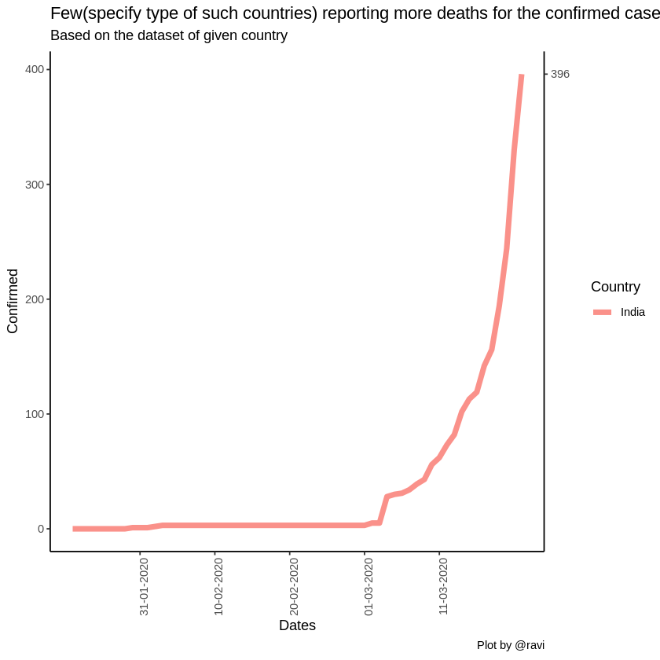
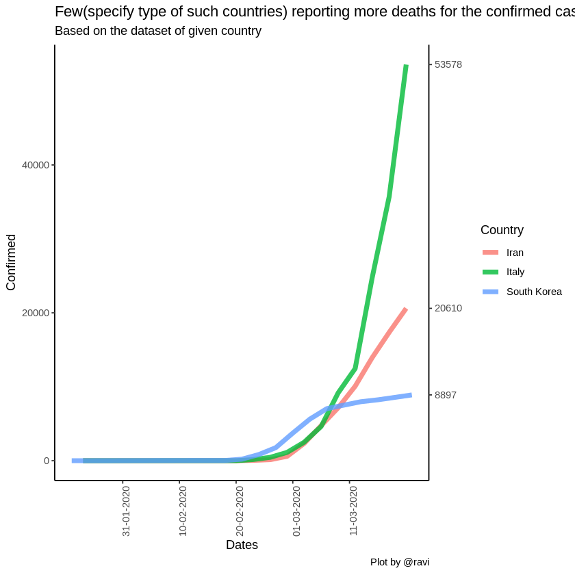
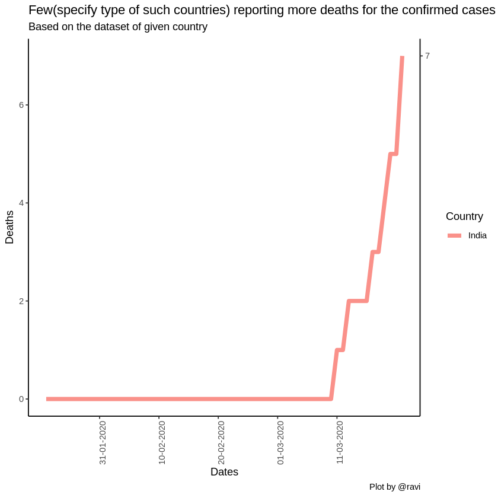
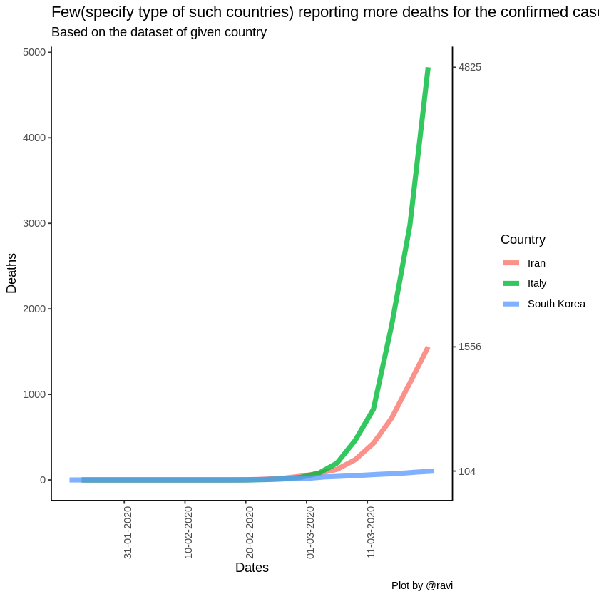
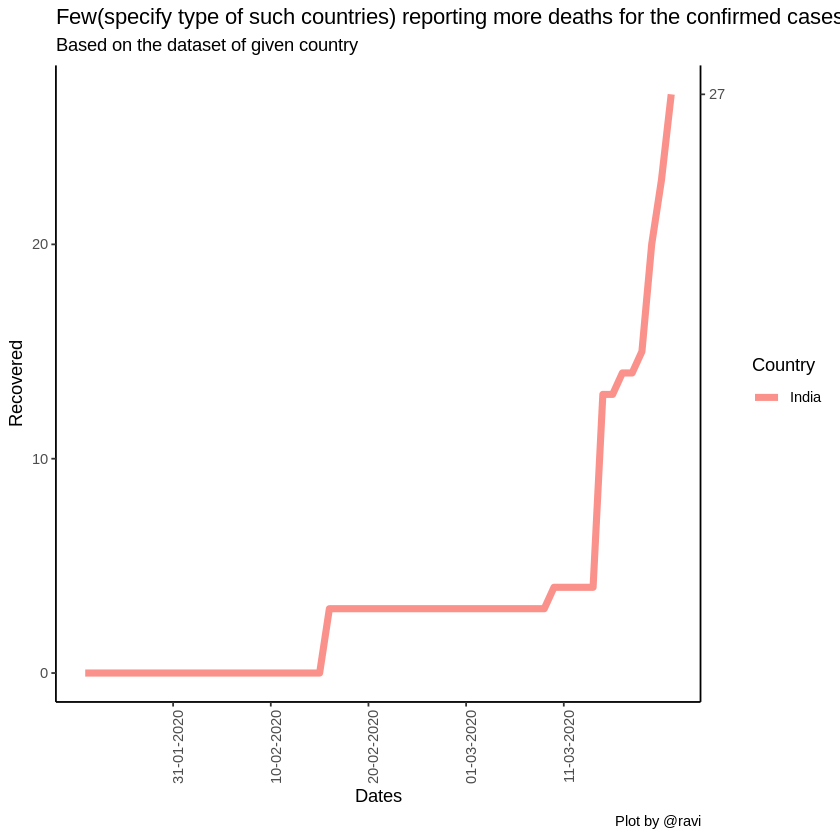
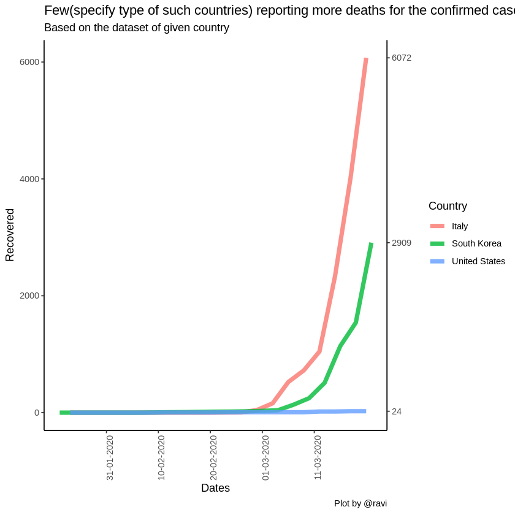
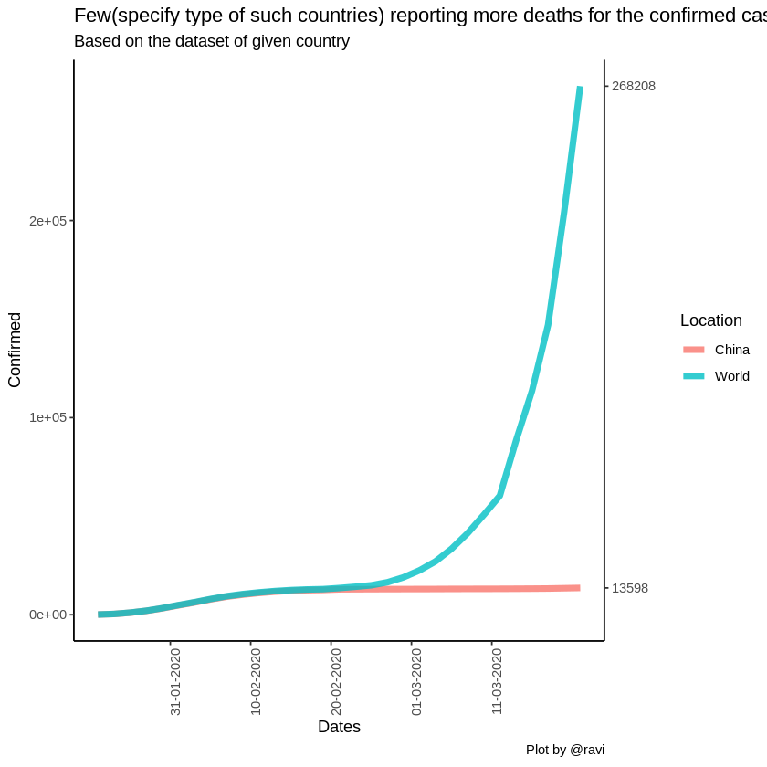
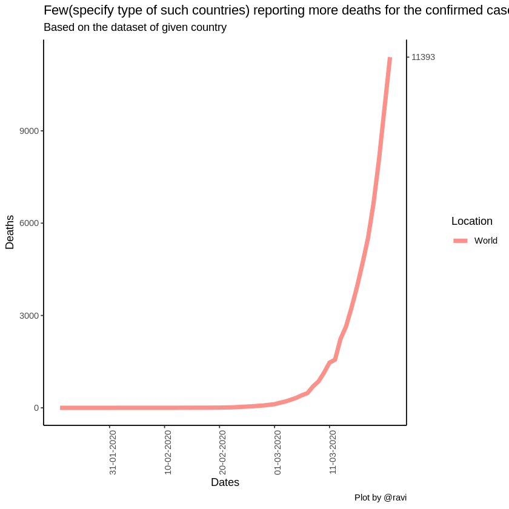
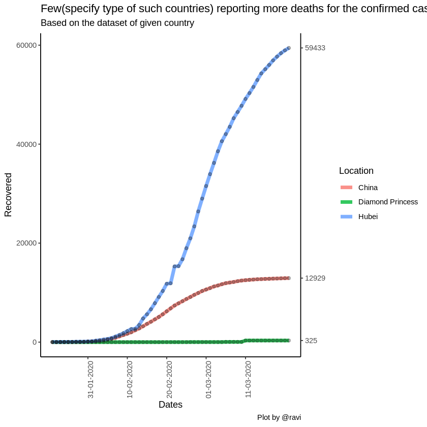

<center><h1> <font color="green"><u>Visualizer</u></font> </h1></center>

<h3> <font color="purple"><u>This section includes:</u></font> </h3>

> * Data Extraction and Manipulation <br />
> * Visualization (Using **ggplot2()**) <br />

<br />

## Creating Datasets


```R
# Setting the working directory
setwd("~/Documents/A-tracking-of-2019-nCoV/COVID-19/")
```


```R
# # Loading desired libraries
library(ggplot2)
library(tidyverse)
library(lattice)

library(plyr) # used to calculate the average weight of each group 
```

    Registered S3 methods overwritten by 'ggplot2':
      method         from 
      [.quosures     rlang
      c.quosures     rlang
      print.quosures rlang
    
    Registered S3 method overwritten by 'rvest':
      method            from
      read_xml.response xml2
    
    ── Attaching packages ─────────────────────────────────────── tidyverse 1.2.1 ──
    
    ✔ tibble  2.1.1     ✔ purrr   0.3.3
    ✔ tidyr   1.0.2     ✔ dplyr   0.8.3
    ✔ readr   1.3.1     ✔ stringr 1.4.0
    ✔ tibble  2.1.1     ✔ forcats 0.4.0
    
    ── Conflicts ────────────────────────────────────────── tidyverse_conflicts() ──
    ✖ dplyr::filter() masks stats::filter()
    ✖ dplyr::lag()    masks stats::lag()
    
    ------------------------------------------------------------------------------
    
    You have loaded plyr after dplyr - this is likely to cause problems.
    If you need functions from both plyr and dplyr, please load plyr first, then dplyr:
    library(plyr); library(dplyr)
    
    ------------------------------------------------------------------------------
    
    
    Attaching package: ‘plyr’
    
    
    The following objects are masked from ‘package:dplyr’:
    
        arrange, count, desc, failwith, id, mutate, rename, summarise,
        summarize
    
    
    The following object is masked from ‘package:purrr’:
    
        compact
    
    


```R
### Loading files ###

Confirmed = read.csv("ready_to_use/COVID-19/Confirmed.csv")
Deaths = read.csv("ready_to_use/COVID-19/Deaths.csv")
Recovered = read.csv("ready_to_use/COVID-19/Recovered.csv")


countryWise.bulk.summary = read.csv("ready_to_use/COVID-19/Mixed/countryWise_bulk_summary.csv")
Four.dataset.locationWise = read.csv("ready_to_use/COVID-19/FOUR/Four_dataset_locationWise.csv")

# train on 80% dates, test on 20%
dateWise.bulk.summary = read.csv("ready_to_use/COVID-19/Mixed/dateWise_bulk_summary.csv")
```

<br /> 
### Functions

* Cases (reported daily)


```R

confirmed.till.date = function(cName, yesORno = FALSE) {
  
  
  countryWise.bulk.summary.country = countryWise.bulk.summary[
    which(str_detect(countryWise.bulk.summary$Country,
                     cName,
                     negate = yesORno)),
    ]
  
  #####################################################
  
  d <- countryWise.bulk.summary.country %>% 
    as_tibble()
  
  d_ends <- countryWise.bulk.summary.country %>% 
    group_by(Country) %>% 
    top_n(1, Day) %>% 
    pull(Confirmed)
  
  temp = as.character(countryWise.bulk.summary$Date[1:nlevels(countryWise.bulk.summary$Date)])
  new = c(temp[10], temp[20], temp[30], temp[40], temp[50])
  
  d %>% 
    ggplot(aes(Day, Confirmed, color = Country)) +
    geom_line(size = 2, alpha = .8) +
    theme_classic() +
    scale_x_continuous(label = new, breaks = c(10, 20, 30, 40, 50)) +
    scale_y_continuous(sec.axis = sec_axis(~ ., breaks = d_ends)) +
    theme(axis.text.x = element_text(angle = 90, hjust = 1)) +
    ggtitle("Few(specify type of such countries) reporting more deaths for the confirmed cases",
            subtitle = "Based on the dataset of given country") +
    labs(x = "Dates", y = "Confirmed", caption = "Plot by @ravi")
  
}

```


```R

deaths.till.date = function(cName, yesORno = FALSE) {
  
  
  countryWise.bulk.summary.country = countryWise.bulk.summary[
    which(str_detect(countryWise.bulk.summary$Country,
                     cName,
                     negate = yesORno)),
    ]
  
  #####################################################
  
  d <- countryWise.bulk.summary.country %>% 
    as_tibble()
  
  d_ends <- countryWise.bulk.summary.country %>% 
    group_by(Country) %>% 
    top_n(1, Day) %>% 
    pull(Deaths)    # col can be changed
  
  temp = as.character(countryWise.bulk.summary$Date[1:nlevels(countryWise.bulk.summary$Date)])
  new = c(temp[10], temp[20], temp[30], temp[40], temp[50])
  
  d %>% 
    ggplot(aes(Day, Deaths, color = Country)) +
    geom_line(size = 2, alpha = .8) +
    theme_classic() +
    scale_x_continuous(label = new, breaks = c(10, 20, 30, 40, 50)) +
    scale_y_continuous(sec.axis = sec_axis(~ ., breaks = d_ends)) +
    theme(axis.text.x = element_text(angle = 90, hjust = 1)) +
    ggtitle("Few(specify type of such countries) reporting more deaths for the confirmed cases",
            subtitle = "Based on the dataset of given country") +
    labs(x = "Dates", y = "Deaths", caption = "Plot by @ravi")
  
}

```


```R

recovery.till.date = function(cName, yesORno = FALSE) {
  
  
  countryWise.bulk.summary.country = countryWise.bulk.summary[
    which(str_detect(countryWise.bulk.summary$Country,
                     cName,
                     negate = yesORno)),
    ]
  
  #####################################################
  
  d <- countryWise.bulk.summary.country %>% 
    as_tibble()
  
  d_ends <- countryWise.bulk.summary.country %>% 
    group_by(Country) %>% 
    top_n(1, Day) %>% 
    pull(Recovered)    # col can be changed
  
  temp = as.character(countryWise.bulk.summary$Date[1:nlevels(countryWise.bulk.summary$Date)])
  new = c(temp[10], temp[20], temp[30], temp[40], temp[50])
  
  d %>% 
    ggplot(aes(Day, Recovered, color = Country)) +
    geom_line(size = 2, alpha = .8) +
    theme_classic() +
    scale_x_continuous(label = new, breaks = c(10, 20, 30, 40, 50)) +
    scale_y_continuous(sec.axis = sec_axis(~ ., breaks = d_ends)) +
    theme(axis.text.x = element_text(angle = 90, hjust = 1)) +
    ggtitle("Few(specify type of such countries) reporting more deaths for the confirmed cases",
            subtitle = "Based on the dataset of given country") +
    labs(x = "Dates", y = "Recovered", caption = "Plot by @ravi")
  
}

```

<br /> 
* for the World-Data


```R

till.date = function(yAxis, dataSet, cName = c("Hubei", "World", "China", "Diamond Princess"), yesORno = FALSE) {
  
  get(dataSet) -> plotFrom
  
  plotFrom = plotFrom[
    which(str_detect(plotFrom$Location,
                     cName,
                     negate = yesORno)),
  ]
  
  #####################################################
  
  d <- plotFrom %>% 
    as_tibble()
  
  d_ends <- plotFrom %>% 
    group_by(Location) %>% 
    top_n(1, Day) %>% 
    pull(yAxis)    # col can be changed to    ---------->    yAxis
  
  temp = as.character(plotFrom$Date[1:nlevels(plotFrom$Date)])
  new = c(temp[10], temp[20], temp[30], temp[40], temp[50])
  
  d %>% 
    ggplot(aes(Day, Recovered, color = Location)) +
    geom_line(size = 2, alpha = .8) +
    theme_classic() +
    scale_x_continuous(label = new, breaks = c(10, 20, 30, 40, 50)) +
    scale_y_continuous(sec.axis = sec_axis(~ ., breaks = d_ends)) +
    theme(axis.text.x = element_text(angle = 90, hjust = 1)) +
    ggtitle("Hubei, China(except Hubei) & World polt, on the daily basis.",
            subtitle = "Based on the summary dataset") +
    labs(x = "Dates", y = yAxis, caption = "Plot by @ravi")
  
}

```


```R

till.date.Confirmed = function(lName = c("Hubei", "World", "China", "Diamond Princess"), yesORno = FALSE) {
  
  
  locationWise.bulk.summary.Four = Four.dataset.locationWise[
    which(str_detect(Four.dataset.locationWise$Location,
                     lName,
                     negate = yesORno)),
    ]
  
  #####################################################
  
  d <- locationWise.bulk.summary.Four %>% 
    as_tibble()
  
  d_ends <- locationWise.bulk.summary.Four %>% 
    group_by(Location) %>% 
    top_n(1, Day) %>% 
    pull(Confirmed)    # col can be changed
  
  temp = as.character(Four.dataset.locationWise$Date[1:nlevels(Four.dataset.locationWise$Date)])
  new = c(temp[10], temp[20], temp[30], temp[40], temp[50])
  
  d %>% 
    ggplot(aes(Day, Confirmed, color = Location)) +
    geom_line(size = 2, alpha = 0.8) +
    theme_classic() +
    scale_x_continuous(label = new, breaks = c(10, 20, 30, 40, 50)) +
    scale_y_continuous(sec.axis = sec_axis(~ ., breaks = d_ends)) +
    theme(axis.text.x = element_text(angle = 90, hjust = 1)) +
    ggtitle("Few(specify type of such countries) reporting more deaths for the confirmed cases",
            subtitle = "Based on the dataset of given country") +
    labs(x = "Dates", y = "Confirmed", caption = "Plot by @ravi")
  
}

```


```R

till.date.Deaths = function(lName = c("Hubei", "World", "China", "Diamond Princess"), yesORno = FALSE) {
  
  
  locationWise.bulk.summary.Four = Four.dataset.locationWise[
    which(str_detect(Four.dataset.locationWise$Location,
                     lName,
                     negate = yesORno)),
    ]
  
  #####################################################
  
  d <- locationWise.bulk.summary.Four %>% 
    as_tibble()
  
  d_ends <- locationWise.bulk.summary.Four %>% 
    group_by(Location) %>% 
    top_n(1, Day) %>% 
    pull(Deaths)    # col can be changed
  
  temp = as.character(Four.dataset.locationWise$Date[1:nlevels(Four.dataset.locationWise$Date)])
  new = c(temp[10], temp[20], temp[30], temp[40], temp[50])
  
  d %>% 
    ggplot(aes(Day, Deaths, color = Location)) +
    geom_line(size = 2, alpha = 0.8) +
    theme_classic() +
    scale_x_continuous(label = new, breaks = c(10, 20, 30, 40, 50)) +
    scale_y_continuous(sec.axis = sec_axis(~ ., breaks = d_ends)) +
    theme(axis.text.x = element_text(angle = 90, hjust = 1)) +
    ggtitle("Few(specify type of such countries) reporting more deaths for the confirmed cases",
            subtitle = "Based on the dataset of given country") +
    labs(x = "Dates", y = "Deaths", caption = "Plot by @ravi")
  
}

```


```R

till.date.Recovered = function(lName = c("Hubei", "World", "China", "Diamond Princess"), yesORno = FALSE) {
  
  
  locationWise.bulk.summary.Four = Four.dataset.locationWise[
    which(str_detect(Four.dataset.locationWise$Location,
                     lName,
                     negate = yesORno)),
    ]
  
  #####################################################
  
  d <- locationWise.bulk.summary.Four %>% 
    as_tibble()
  
  d_ends <- locationWise.bulk.summary.Four %>% 
    group_by(Location) %>% 
    top_n(1, Day) %>% 
    pull(Recovered)    # col can be changed
  
  temp = as.character(Four.dataset.locationWise$Date[1:nlevels(Four.dataset.locationWise$Date)])
  new = c(temp[10], temp[20], temp[30], temp[40], temp[50])
  
  d %>% 
    ggplot(aes(Day, Recovered, color = Location)) +
    geom_line(size = 2, alpha = 0.8) +
    geom_point(color = "black", alpha = 0.3) +
    theme_classic() +
    scale_x_continuous(label = new, breaks = c(10, 20, 30, 40, 50)) +
    scale_y_continuous(sec.axis = sec_axis(~ ., breaks = d_ends)) +
    theme(axis.text.x = element_text(angle = 90, hjust = 1)) +
    ggtitle("Few(specify type of such countries) reporting more deaths for the confirmed cases",
            subtitle = "Based on the dataset of given country") +
    labs(x = "Dates", y = "Recovered", caption = "Plot by @ravi")
  
}

```

<hr /> <br /> 

### VISUALIZATIONS

* #### Line Plots


```R
confirmed.till.date("India")
```





```R
confirmed.till.date(c("Italy", "South Korea", "Iran"), F)
```

    Warning message in stri_detect_regex(string, pattern, negate = negate, opts_regex = opts(pattern)):
    “longer object length is not a multiple of shorter object length”





<br />


```R
deaths.till.date("India")
```





```R
deaths.till.date(c("Italy", "South Korea", "Iran"))
```

    Warning message in stri_detect_regex(string, pattern, negate = negate, opts_regex = opts(pattern)):
    “longer object length is not a multiple of shorter object length”





<br />


```R
recovery.till.date("India")
```





```R
recovery.till.date(c("Italy", "South Korea", "United States"))
```

    Warning message in stri_detect_regex(string, pattern, negate = negate, opts_regex = opts(pattern)):
    “longer object length is not a multiple of shorter object length”





<br />

* #### BEST


```R
## a Histogram or Bar plot will be better for --> Four.dataset.locationWise
head(Four.dataset.locationWise, 10)
```


<table>
<thead><tr><th scope=col>Location</th><th scope=col>Day</th><th scope=col>Date</th><th scope=col>Confirmed</th><th scope=col>Deaths</th><th scope=col>Recovered</th><th scope=col>Active.Cases</th><th scope=col>Closed.Cases</th></tr></thead>
<tbody>
	<tr><td>Hubei     </td><td> 1        </td><td>22-01-2020</td><td> 444      </td><td> 17       </td><td> 28       </td><td> 399      </td><td> 45       </td></tr>
	<tr><td>Hubei     </td><td> 2        </td><td>23-01-2020</td><td> 444      </td><td> 17       </td><td> 28       </td><td> 399      </td><td> 45       </td></tr>
	<tr><td>Hubei     </td><td> 3        </td><td>24-01-2020</td><td> 549      </td><td> 24       </td><td> 31       </td><td> 494      </td><td> 55       </td></tr>
	<tr><td>Hubei     </td><td> 4        </td><td>25-01-2020</td><td> 761      </td><td> 40       </td><td> 32       </td><td> 689      </td><td> 72       </td></tr>
	<tr><td>Hubei     </td><td> 5        </td><td>26-01-2020</td><td>1058      </td><td> 52       </td><td> 42       </td><td> 964      </td><td> 94       </td></tr>
	<tr><td>Hubei     </td><td> 6        </td><td>27-01-2020</td><td>1423      </td><td> 76       </td><td> 45       </td><td>1302      </td><td>121       </td></tr>
	<tr><td>Hubei     </td><td> 7        </td><td>28-01-2020</td><td>3554      </td><td>125       </td><td> 80       </td><td>3349      </td><td>205       </td></tr>
	<tr><td>Hubei     </td><td> 8        </td><td>29-01-2020</td><td>3554      </td><td>125       </td><td> 88       </td><td>3341      </td><td>213       </td></tr>
	<tr><td>Hubei     </td><td> 9        </td><td>30-01-2020</td><td>4903      </td><td>162       </td><td> 90       </td><td>4651      </td><td>252       </td></tr>
	<tr><td>Hubei     </td><td>10        </td><td>31-01-2020</td><td>5806      </td><td>204       </td><td>141       </td><td>5461      </td><td>345       </td></tr>
</tbody>
</table>


<br />


```R
# Lines
till.date.Confirmed(c("World", "China"))
```





```R
till.date.Deaths("World")
```





```R
till.date.Recovered("World", T)
```





<hr /><br />
